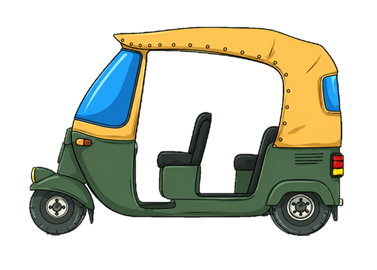

# कॉफ़ी_कला (Coffee Kala) - High Voltage Brew

A brutalist-editorial coffee e-commerce experience featuring cinematic 3D coffee beans, interactive typography, and a premium shopping experience.



## 🎨 Design Philosophy

**Brutalist-Editorial Aesthetic**
- Bold typography with dramatic scale
- Hard shadows and thick borders
- Warm coffee-inspired color palette
- Cinematic 3D floating coffee beans (desktop)
- Clean editorial typography (mobile)

**Color Palette**
- Primary: `#25160e` (Deep Espresso)
- Secondary: `#7d562d` (Roasted Brown)
- Accent: `#8B6F47` (Coffee Bean)
- Background: `#E8DCC8` (Cream)
- Highlights: `#FFCA98` (Warm Orange)

## ✨ Features

### 🖥️ Desktop Experience
- **3D Floating Coffee Beans**: Real-time rendered 3D coffee bean models using Three.js
- **Interactive Text**: Letters change color when beans pass behind them
- **Mouse Interaction**: Beans react to cursor movement with physics-based disturbance field
- **Parallax Effects**: Multi-layer depth with smooth parallax scrolling
- **Cinematic Lighting**: Professional lighting setup with key, fill, rim, and accent lights

### 📱 Mobile Experience
- **Typography-First Design**: Oversized editorial typography optimized for mobile
- **Performance Optimized**: No heavy 3D rendering on mobile devices
- **Subtle Animations**: Gentle fade-ins and floating effects
- **Clean Layout**: Spacious composition with improved readability
- **Static Bean Images**: Lightweight decorative elements instead of 3D

### 🛒 E-Commerce Features
- **Product Catalog**: Featured coffee blends with hover effects
- **Shopping Cart**: Interactive cart with quantity controls and grind selection
- **Checkout Flow**: Complete payment and delivery form
- **Order Confirmation**: Animated thank you page with order summary
- **Maker Bundle**: Special bundle offer with 20% discount
- **Profile Dashboard**: User account with subscription management and extraction profiles

### 🎭 Interactive Elements
- **Dynamic Cart Badge**: Real-time item count updates
- **Grind Selection**: Choose between COARSE, FINE, and ESPRESSO
- **Quantity Controls**: Increment/decrement with live total updates
- **Remove Items**: Smooth fade-out animations
- **Page Transitions**: Elegant fade transitions between pages
- **Progress Tracking**: Visual roast cycle progress bar

## 📁 Project Structure

```
कॉफ़ी_कला/
├── index.html              # Main landing page with 3D beans
├── cart.html               # Shopping cart and checkout
├── profile.html            # User profile dashboard
├── thankyou.html           # Order confirmation
├── extraction.html         # Brewing methods guide
├── locations.html          # Store locations
├── subscriptions.html      # Subscription plans
├── privacy.html            # Privacy policy
├── terms.html              # Terms of service
│
├── styles.css              # Main stylesheet with brutalist design
├── main.js                 # Three.js scene initialization
├── beans.js                # 3D coffee bean loading and animation
├── interaction.js          # Mouse interaction and parallax
├── text-interaction.js     # Interactive typography effects
├── cart.js                 # Shopping cart functionality
├── bundle.js               # Maker bundle add-to-cart
├── transitions.js          # Page transition system
├── progress.js             # Progress bar animations
│
├── Coffee bean/            # 3D model files
│   ├── 218_Coffee Bean.obj
│   ├── 218_Coffee Bean.mtl
│   └── 218_Coffee Bean.png
│
├── img/                    # Image assets
│   ├── cute_auto_nobg.png
│   └── [coffee images]
│
├── .gitignore
└── README.md
```

## 🚀 Getting Started

### Prerequisites
- Modern web browser (Chrome, Firefox, Safari, Edge)
- Local web server (for loading 3D models)

### Installation

1. **Clone the repository**
   ```bash
   git clone https://github.com/yourusername/coffee-kala.git
   cd coffee-kala
   ```

2. **Start a local server**
   
   Using Python:
   ```bash
   python -m http.server 8000
   ```
   
   Using Node.js:
   ```bash
   npx http-server -p 8000
   ```
   
   Using PHP:
   ```bash
   php -S localhost:8000
   ```

3. **Open in browser**
   ```
   http://localhost:8000
   ```

### Why a local server?
The 3D coffee bean models (OBJ/MTL files) require a web server due to CORS restrictions. Opening `index.html` directly in a browser won't load the 3D models.

## 🎯 Key Pages

### Landing Page (`index.html`)
- Hero section with 3D floating beans (desktop) or editorial typography (mobile)
- Featured coffee blends grid
- Roast cycle progress indicator
- Maker bundle promotional card

### Shopping Cart (`cart.html`)
- Interactive cart items with images
- Quantity controls (+/-)
- Grind selection (COARSE, FINE, ESPRESSO)
- Remove items with animation
- Live total calculation
- Payment and delivery form
- Order summary sidebar

### Profile Dashboard (`profile.html`)
- Member information and status badges
- Current subscription details
- Upcoming delivery schedule
- Extraction profile with temperature, pressure, and flow rate
- Roast history table
- Caffeine consumption charts
- Monthly volume tracking
- System override protocol

### Thank You Page (`thankyou.html`)
- Animated checkmark confirmation
- Order summary with items and totals
- Staggered fade-in animations
- Continue shopping and track order CTAs

## 🎨 Design System

### Typography
- **Display**: Space Grotesk (700-900 weight)
- **Headlines**: Space Grotesk (600-700 weight)
- **Body**: Inter (400 weight)
- **Technical**: JetBrains Mono (400-700 weight)
- **Brand**: Yatra One (for logo)

### Spacing Scale
- `xs`: 4px
- `sm`: 8px
- `md`: 16px
- `lg`: 24px
- `xl`: 48px
- `margin`: 32px

### Border Styles
- Standard: 2px solid black
- Heavy: 4px solid black
- Shadows: Hard drop shadows (4px, 8px, 12px)

### Animations
- **Page Transitions**: 300ms fade
- **Hover Effects**: 200ms ease
- **Active Press**: Transform translate with shadow removal
- **Fade In**: 600-800ms ease-out
- **Floating**: 6s ease-in-out infinite

## 🔧 Technical Details

### 3D Rendering (Desktop Only)
- **Library**: Three.js r128
- **Models**: OBJ/MTL format with texture maps
- **Lighting**: 5-point cinematic lighting setup
- **Performance**: 25 beans with optimized geometry
- **Interaction**: Real-time mouse tracking with physics

### Mobile Optimization
- **Detection**: `window.innerWidth < 769`
- **3D Disabled**: No Three.js initialization on mobile
- **Lightweight**: Static images and CSS animations only
- **Performance**: Fast load times, smooth 60fps animations

### Cart System
- **Storage**: LocalStorage for cart persistence
- **Updates**: Real-time total recalculation
- **Validation**: Required form fields
- **Session**: SessionStorage for order confirmation

### Page Transitions
- **Overlay**: Full-screen dark overlay with spinner
- **Duration**: 300ms fade in/out
- **Smart Detection**: Only applies to internal links
- **Browser Support**: Back/forward button compatible

## 📱 Responsive Breakpoints

- **Mobile**: < 768px (Editorial typography hero)
- **Tablet**: 768px - 1024px
- **Desktop**: > 1024px (Full 3D bean experience)

## 🎭 Interactive Features

### Text Interaction (Desktop)
Letters in "HIGH VOLTAGE BREW" change color when 3D beans pass behind them:
- Real-time 3D-to-2D projection
- Distance-based color interpolation
- Glow effects and subtle scaling
- 60fps performance

### Bean Physics
- Floating animation with individual speeds
- Mouse disturbance field with repulsion
- Spring-like return to original position
- Rotation based on interaction strength

### Cart Interactions
- Quantity increment/decrement
- Grind type toggle selection
- Remove with fade-out animation
- Auto-save to LocalStorage

## 🌐 Browser Support

- Chrome/Edge: ✅ Full support
- Firefox: ✅ Full support
- Safari: ✅ Full support
- Mobile browsers: ✅ Optimized experience

## 📦 Dependencies

### External Libraries
- **Three.js** (r128): 3D rendering
- **Tailwind CSS** (CDN): Utility-first CSS
- **Google Fonts**: Typography
- **Material Symbols**: Icons

### No Build Process Required
All dependencies loaded via CDN - no npm, webpack, or build tools needed!

## 🎨 Customization

### Colors
Edit the Tailwind config in each HTML file's `<script id="tailwind-config">` section.

### Typography
Modify font families in the Tailwind config and update CSS font-family declarations.

### 3D Beans
- Adjust bean count in `beans.js` (`beanCount` variable)
- Modify animation speeds in `userData` properties
- Change lighting in `main.js`

### Cart Items
Update default items in `cart.html` or modify `loadCartFromStorage()` in `cart.js`.

## 🚀 Performance Tips

### Desktop
- Bean count optimized at 25 (balance between visual richness and performance)
- Geometry cloning for efficient memory usage
- Fog for depth perception without extra rendering cost

### Mobile
- 3D rendering completely disabled
- Static images with CSS transforms
- Minimal JavaScript execution
- Fast page load times

## 📝 Future Enhancements

- [ ] User authentication system
- [ ] Real payment gateway integration
- [ ] Order tracking functionality
- [ ] Email confirmation system
- [ ] Product reviews and ratings
- [ ] Wishlist feature
- [ ] Multiple shipping addresses
- [ ] Subscription management
- [ ] Admin dashboard
- [ ] Inventory management

## 🤝 Contributing

Contributions are welcome! Please feel free to submit a Pull Request.

## 📄 License

This project is open source and available under the MIT License.

## 👨‍💻 Author

Created with ☕ and code

## 🙏 Acknowledgments

- Coffee bean 3D model from [source]
- Coffee images from Unsplash
- Inspiration from brutalist web design and specialty coffee culture

---

**कॉफ़ी_कला** - Where precision meets passion in every brew. ☕✨
